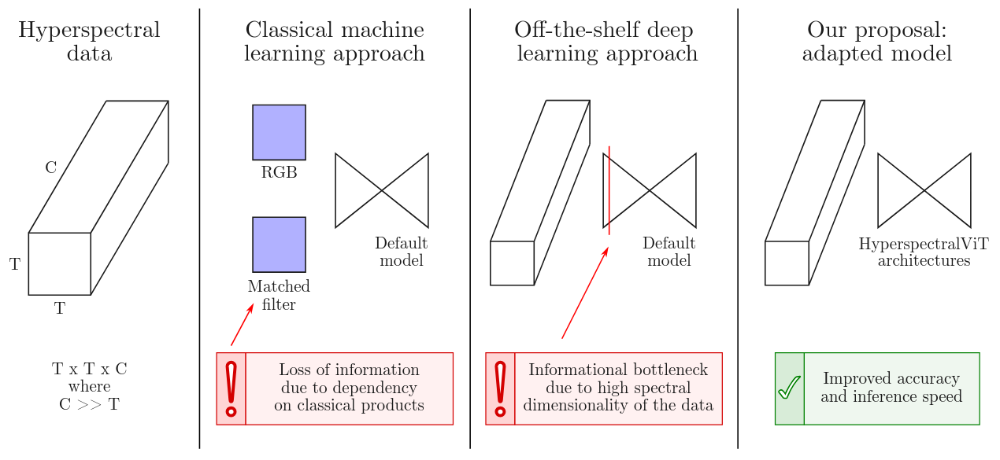

# HyperspectralViTs

<table><tr>
  <td>
    <b>The HyperspectralViTs models and ecosystem</b><br>
    <em>We introduce the HyperspectralViTs models and the OxHyper datasets of hyperspectral data from the NASA's EMIT sensor. We show that the proposed models outperform prior deep learning models in both score and processing speed. We test our models on low-compute hardware. Finally, we release the full annotated training, validation and test datasets of real and synthetic methane events and mineral maps.
    </em>
</td>  
</tr></table>

<p align="center">
  <a href="https://ieeexplore.ieee.org/document/10948267">IEEE JSTARS Paper 2025</a> •
  <a href="https://www.cs.ox.ac.uk/news/2378-full.html">Oxford Department of Computer Science news</a>
</p>

<p align="center">
  <a href="https://www.ted.com/talks/vit_ruzicka_how_ai_helps_us_track_methane_from_space">TED AI in Vienna 2024</a> talk •
  <a href="https://huggingface.co/collections/previtus/oxhyper-datasets-67f13a7dc7c67c9941e17c5c"> Datasets on Hugging Face🤗</a>
</p>

---

## HyperspectralViTs: General Hyperspectral Models for On-board Remote Sensing

<details>
  <summary><b>Abstract</b></summary>
  On-board processing of hyperspectral data with machine learning models would enable an unprecedented amount of autonomy across a wide range of tasks allowing new capabilities such as early warning systems and automated scheduling across constellations of satellites. However, current classical methods suffer from high false positive rates and therefore prevent easy automation while previously published deep learning models exhibit prohibitive computational requirements. We propose fast and accurate machine learning architectures which support endto-end processing of data with high spectral dimension without relying on hand-crafted products or spectral band compression techniques. We create three new large datasets of hyperspectral data containing all relevant spectral bands from the near global sensor EMIT. We evaluate our models on two tasks related to hyperspectral data processing - methane detection and mineral identification. Our models reach a new state-of-the-art performance on the task of methane detection, where we improve the F1 score of previous deep learning models by 27% on a newly created synthetic dataset and by 13% on the previously released large benchmark dataset. Our models generalise from synthetic datasets to data with real methane leak events and boost performance by 6.9% in F1 score in contrast with training models from scratch on the real data. Finally, with our newly proposed architectures, one capture from the EMIT sensor can be processed within 30 seconds on a realistic proxy of the IONSCV 004 satellite and in less than 0.64 seconds on a GPU powered Jetson AGX Xavier board.
</details>

<table>
<tr>
  <td width="100%" align="center"><br>
  Illustration of the motivation behind the proposed machine learning models.
  </td>
</tr>
</table>


### OxHyper datasets

In the paper we present three newly created OxHyper datasets with labels for 1.) <a href="https://huggingface.co/datasets/previtus/OxHyperRealCH4">real methane leak events</a>, 2.) <a href="https://huggingface.co/datasets/previtus/OxHyperSyntheticCH4">synthetic methane leak events</a> and 3.) dataset <a href="https://huggingface.co/datasets/previtus/OxHyperMinerals_Train">mineral identification</a>. In these, we provide wide range of hyperspectral bands from EMIT, computed methane enhancement products and also manually checked labels. We also use a new version of previously released STARCOP dataset of events from the AVIRIS-NG data, which can be collectively explored in <a href="https://huggingface.co/collections/previtus/starcop-67f13cf30def71591f281a41">here</a>. For more details see the paper.

**Downloading datasets**

Please note that created datasets are very large. As an example, to download the OxHyperSyntheticCH4 dataset (of 226 GB), run this:

```bash
git lfs install
git clone https://huggingface.co/datasets/previtus/OxHyperSyntheticCH4
# it is recommended to delete the .git folder to save space:
rm -rdf OxHyperSyntheticCH4/.git
```
We recommend first trying some of the miniaturized datasets versions, for example: https://huggingface.co/datasets/previtus/starcop_allbands_mini

For an updated list of datasets please check the main page: https://huggingface.co/previtus

### Code examples

**Install**

```bash
conda create -c conda-forge -n hyper_env python=3.11.4 mamba
conda activate hyper_env

pip install git+https://github.com/previtus/HyperspectralViTs.git
```

**Inference**

Demo notebooks for showing model inference on Google Colab are being prepared.

**Training**

To reproduce the same training process as reported in the paper, you will need to download the appropriate OxHyper dataset first, and prepare the coding environment.
Remember to adjust paths in _scripts/settings.yaml_, as these will be used as defaults for the runs. In _/bash_ we provide couple of example training and evaluation scripts (with local overwrites to settings, so remember to adjust these too). 

```bash
# Check possible parameters with:
!python3 -m scripts.train --help

# Or run one of the prepared training scripts used for the paper models (remember to download and adjust the paths to the training datasets)
./bash/demos_train_hyper_segformer.sh
./bash/demos_train_hyper_efficientvit.sh

# You may also check data exploration demos listed in:
.bash/demos_data_explore.sh
```

## Citation
If you find the HyperspectralViTs models or the OxHyper datasets useful in your research, please consider citing our work. 

```
@article{Ruzicka2025HyperspectralViTs,
  author={Růžička, Vít and Markham, Andrew},
  journal={IEEE Journal of Selected Topics in Applied Earth Observations and Remote Sensing}, 
  title={Hyperspectral{V}i{T}s: General Hyperspectral Models for On-Board Remote Sensing}, 
  year={2025},
  volume={18},
  number={},
  pages={10241-10253},
  doi={10.1109/JSTARS.2025.3557527}
}
```

## More information

- Models presented here are directly linked with our prior research in [spaceml-org/STARCOP](https://github.com/spaceml-org/STARCOP)
- We use the newest researched models for Methane leak detection in processing pipelines at the [UN International Methane Emissions Observatory](https://www.linkedin.com/posts/methanedata_ai-cutmethane-methane-activity-7308510159247425536-6BwY?utm_source=share&utm_medium=member_desktop&rcm=ACoAABd6n3gBH_TpjLoZGQEwCvWk3dFjnjz3IyE) to speed up the work of analysts


## Acknowledgments

We would like to thank D-Orbit and Unibap for access to the SpaceCloud® Hardware when measuring our models inference speeds on realistic hardware proxy of a real satellite environment.
